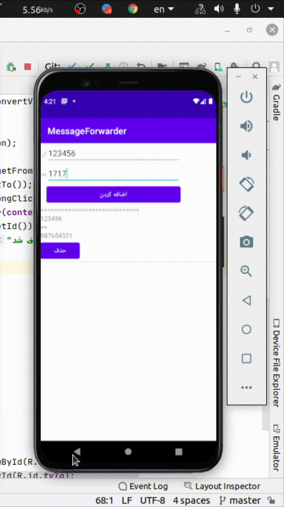

# AndroidMessageForwarder
A simple program to forward SMS.

# Video

1. Add the source=>destination pair to the list
2. The app will listen for new SMS from sources and it will send it to equivalent destinations.

# How to use
Build the APK and install on your device.