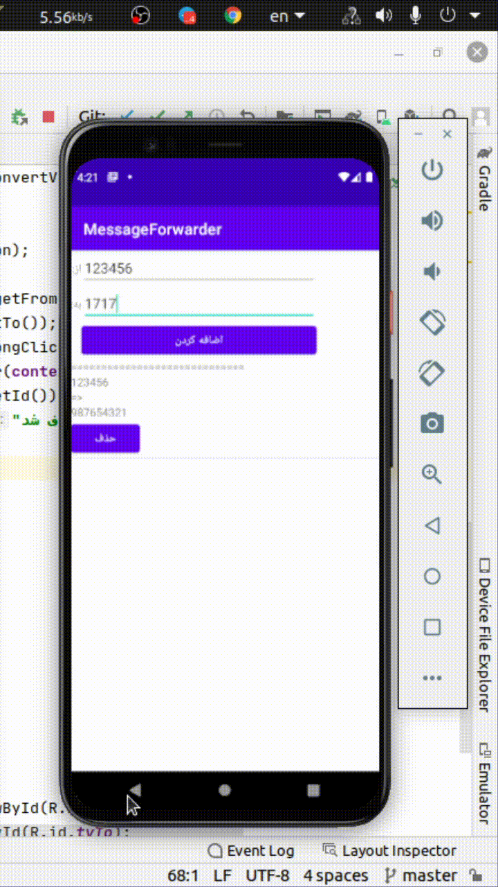

# AndroidMessageForwarder
A simple and elegant SMS forwarding and auto-reply application for Android.

## Features

### SMS Forwarding
Forward SMS messages from specific source numbers to destination numbers automatically.

### Auto-Reply
Automatically reply to incoming SMS messages based on configurable rules. The app comes with a default rule to handle Persian cancellation messages.

**Default Auto-Reply Rule:**
- When receiving messages containing: `لغو۱۱`, `لغو11`, `لغو 11`, or `لغو ۱۱`
- Automatically sends: `11`

### Enhanced UI
Modern Material Design interface with improved colors, card layouts, and better usability.

## Video


## How to Use

### Installation
1. Download the latest APK from the [Releases](../../releases) page
2. Install on your Android device
3. Grant SMS permissions when prompted

### Usage
1. Add source=>destination pairs to the list for SMS forwarding
2. The app will listen for new SMS from sources and forward them to destinations
3. Auto-reply rules work automatically for all incoming messages

### Building from Source
The APK is automatically built and signed on every push to master and on releases via GitHub Actions.

To build manually:
```bash
./gradlew assembleRelease
```

The APK will be available in `app/build/outputs/apk/release/`

## Requirements
- Android 4.1 (API 16) or higher
- SMS permissions (RECEIVE_SMS, SEND_SMS)

## License
Open source project for SMS forwarding and auto-reply functionality.